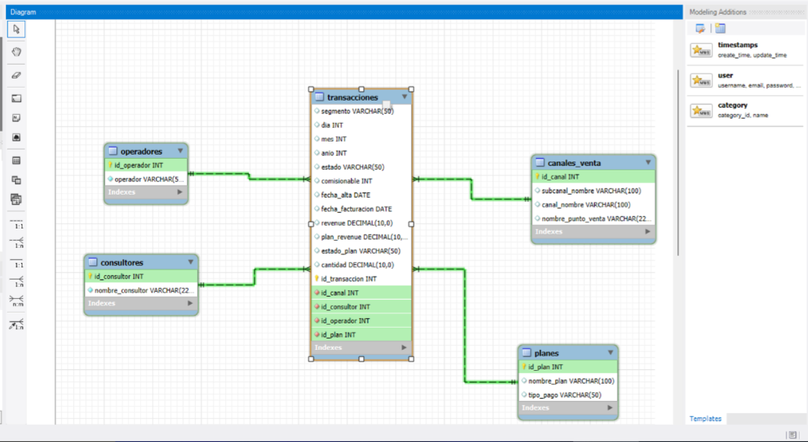

# Air-Quality-New-York-2020-2024
Este proyecto estudia la evolución diaria de PM2.5 y AQI en la ciudad de Nueva York, utilizando datos históricos entre 2020 y 2024. 

---

# 🗽 Calidad del Aire en Nueva York (2020–2024)

Este repositorio documenta el análisis de series temporales de **PM2.5** y **AQI** en la ciudad de Nueva York, con datos recopilados entre 2020 y 2024. El objetivo es identificar patrones estacionales, anomalías y correlaciones entre contaminantes y calidad del aire, con especial atención a eventos extremos como incendios forestales y olas de calor.

---

## 📁 Estructura del repositorio

- `data/` → Datasets originales y procesados (`.csv`)
- `notebooks/` → Análisis exploratorio en Jupyter Notebooks (`.ipynb`)
- `output/` → Gráficos generados
- `src/` → Scripts en Python reutilizables
- `README.md` → Descripción del proyecto
- `requirements.txt` → Dependencias del entorno (matplotlib, seaborn, pandas...)

---

## 📐 Diagrama ER del Data Mart

A continuación, se muestra el modelo dimensional utilizado para el análisis:

---

## 📈 Visualizaciones incluidas

- Boxplots mensuales para PM2.5
- Series temporales con umbrales de calidad del aire
- Gráficos de dispersión y detección de valores atípicos por estación

---

👤 Autor
César Díaz — Análisis, visualización y diseño del modelo de datos.

---

⚖️ Licencia
Este proyecto está bajo la MIT License.

---

🌐 Recursos

- [Datos de calidad del aire de la EPA](https://www.epa.gov/outdoor-air-quality-data)
- [Guía de AQI](https://www.airnow.gov/aqi/aqi-basics/)
- [Datos históricos de calidad del aire en NYC](https://data.cityofnewyork.us/Environmental/NYC-Air-Quality/ahf8-c8hn)
- [Air Quality Monitoring - NYSDEC](https://www.dec.ny.gov/chemical/8406.html)
- [PM2.5 y AQI en tiempo real - IQAir](https://www.iqair.com/us/usa/new-york/new-york-city)
- [Documentación de Seaborn](https://seaborn.pydata.org/)
